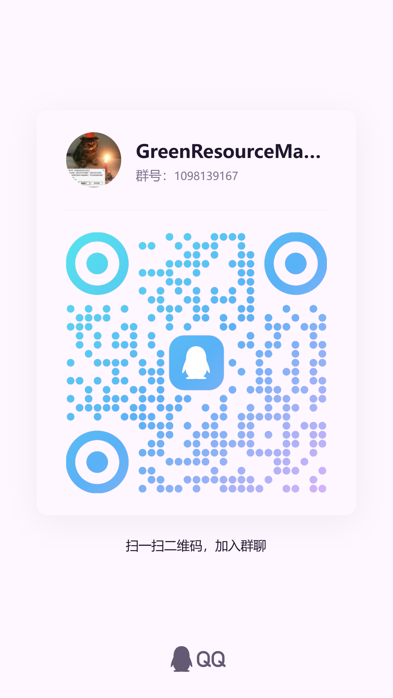

# Green Resources Manager（绿色资源管理器）

**一款全能、免费的本地多媒体资源管理器。可以轻松帮您管理游戏、漫画、小说、音乐、网站等资源。**

**另外附加了游戏化，可以让您的资源收集和管理变得像游戏一样有趣！上头！**

[](https://github.com/klsdf/GreenResourcesManager) [](LICENSE) [](https://github.com/klsdf/GreenResourcesManager) [](https://vuejs.org/) [](https://www.electronjs.org/)

[](https://space.bilibili.com/3690993813555960?spm_id_from=333.1007.0.0) [](https://qm.qq.com/q/16bCL6VeTo) [](https://hat-soft.top/)

[English](README_EN.md) | [中文](#)

QQ客服群：853149421

📖 [**帮助手册**](./green-resources-manager/help-site/index.html)

## 📑 目录

* [📖 产品介绍](#-产品介绍)
  * [开发背景](#开发背景)
  * [目标用户](#目标用户)
  * [项目特色](#项目特色)
  * [技术栈](#技术栈)
  * [截图](#截图)
* [💾 普通用户的下载](#-普通用户的下载)
* [🛠️ 开发者的环境配置](#️-开发者的环境配置)
  * [前置要求](#前置要求)
  * [绿色资源管理器的构建](#绿色资源管理器的构建)
  * [宣传视频的构建](#宣传视频的构建)
* [第三方软件/代码声明](#第三方软件代码声明)
* [🚀 未来规划](#-未来规划)
* [🤝 加入我们](#-加入我们)

## 📖 产品介绍

### 开发背景

Green Resources Manager 是一款专为"仓鼠症"用户设计的全能多媒体资源管理器。随着存储成本的降低，个人拥有大容量存储已成为可能，但管理海量资源的难度也随之增加。当资源超过 10TB 后，无论是按种类还是按常用程度分类，都难以满足需求。

**Green Resources Manager 应运而生**，提供统一界面管理游戏、漫画、视频、音频、小说、网站等各类多媒体资源，让资源管理变得优雅而高效。

### 目标用户

- 拥有强烈仓鼠症的用户
- 希望以更优雅方式管理软件和媒体的用户

### 项目特色

- **🎯 一站式多媒体管理**：统一界面管理游戏、漫画、视频、音频、小说、网站等各类资源
- **🔍 强大的筛选系统**：支持标签、作者、系列等多维度筛选和实时搜索
- **📱 内置播放器/阅读器**：内置游戏启动器、漫画阅读器、视频播放器、音频播放器和小说阅读器
- **💾 强大的数据记录功能**：记录游戏时长、漫画阅读次数、视频观看进度等数据，还可以像steam一样轻松在游戏内截图
- **⚡ Flash游戏支持**：一键启动Flash游戏，无需额外配置，轻松重温经典
- **📦 智能解压功能**：自动查找密码解压压缩包，支持常用密码库，让资源提取更便捷
- **🎮 游戏化体验**：软件内包含成就系统、桌宠、放置养成游戏等游戏化功能，让资源管理更有趣！

### 技术栈

产品

- **前端框架**: Vue 3
- **构建工具**: Vite
- **桌面框架**: Electron
- **开发语言**: TypeScript
- **样式预处理**: SCSS

### 截图


## 💾 普通用户的下载

1. [从github直接下载](https://github.com/klsdf/GreenResourcesManager/releases/latest)

## 🛠️ 开发者的环境配置

### 前置要求

- Node.js (推荐使用 LTS 版本)
- npm
- 本项目使用 **Electron 29**；若本机为 Node 24，安装后需对原生模块执行 `electron-rebuild`（见下）。

### 绿色资源管理器的构建

#### 1. 进入目录

```shell
cd green-resources-manager
```

#### 2. 安装依赖

```bash
npm install
```

#### 3. 原生模块（better-sqlite3）与 Electron 一致

若运行时报错：`was compiled against a different Node.js version using NODE_MODULE_VERSION 137 ... requires NODE_MODULE_VERSION 121`，说明 better-sqlite3 是按系统 Node 编译的，需按 **Electron 29** 重新编译：

```bash
npm install --save-dev electron-rebuild
npx electron-rebuild
```

之后每次 `npm install` 后若涉及原生模块，建议再执行一次 `npx electron-rebuild`。

#### 4. 调试应用

启动Vite开发服务器和Electron应用

```shell
npm run electron-dev
```

#### 5. 构建应用

```bash
npm run electron-build
```

## 第三方软件/代码声明

- 本项目使用了 [Ruffle](https://ruffle.rs)来运行flash游戏。
- 本项目的epub阅读器的设计参考了 [vue-epub-reader](https://github.com/lyh-create/vue-epub-reader)

## 🚀 未来规划

- [ ] **游戏化功能**
  - [ ] 游戏剧情和主线
  - [ ] 时间表和每日任务
- [ ] **社群化功能**
  - [ ] 登录注册系统
  - [ ] 社区功能
  - [ ] 评论系统
  - [ ] 数据同步
- [ ] **资源刮削**
  - [ ] 自动查找本地资源，并加入到管理器
  - [ ] 自动收集Steam、Dlsite、Itch等网站的资源，获得tag、简介等数据
- [ ] **辅助功能**
  - [ ] 游戏攻略
  - [ ] 游戏修改器
  - [ ] 游戏修改教程

## 🤝 加入我们

如果有开发意愿，欢迎Fork本项目并提交Pull Request!

也欢迎来加入客服群@群主！让我们一起开发！

点击链接加入群聊【GreenResourceManager里群*李代数】：https://qm.qq.com/q/HgPf1nA4UK



<div align="center">
  
</div>
<div align="center">Made by YanChenXiang ❤️</div>
[⬆ 回到顶部](#-目录)
